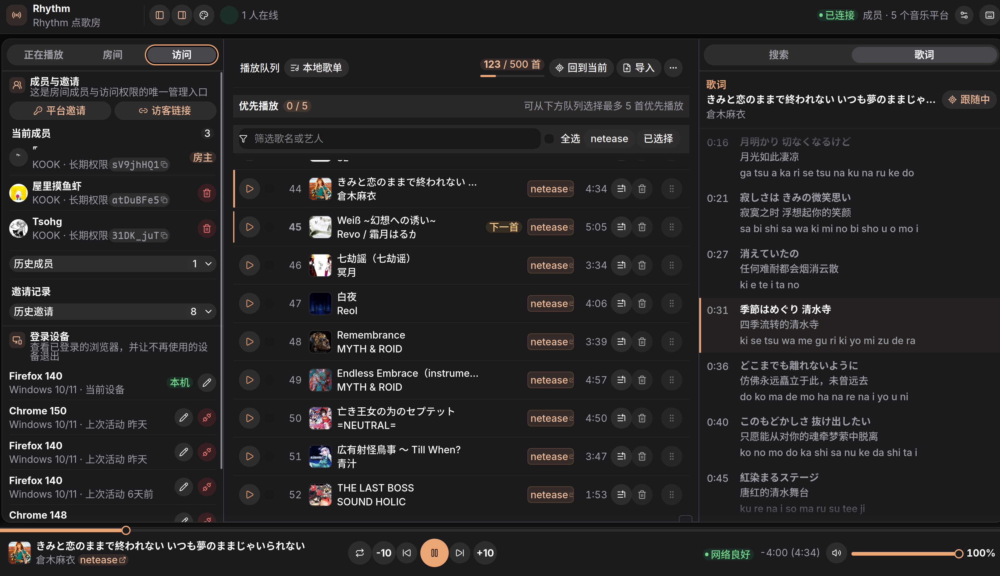
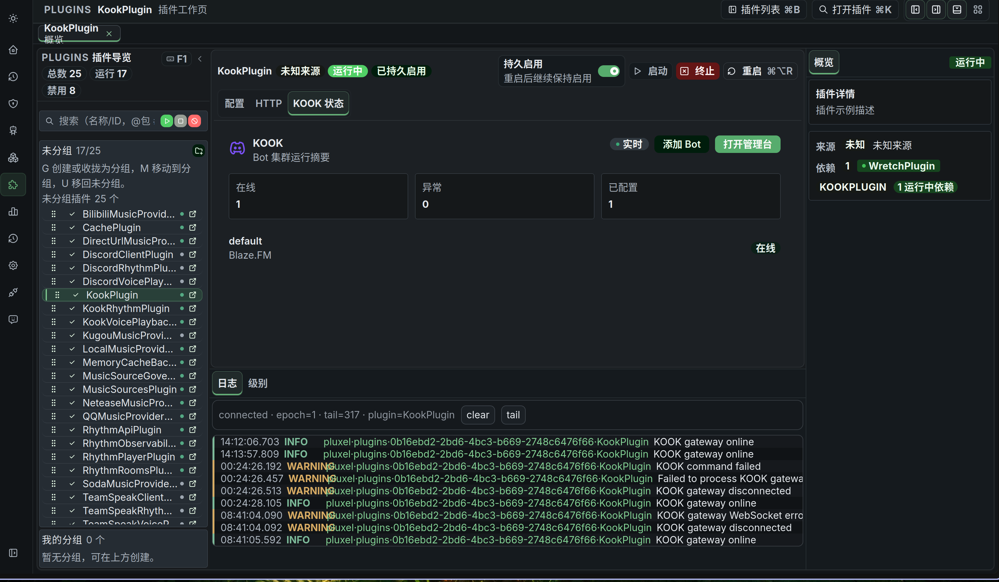

# 🎵 Rhythm

### 为 KOOK、Discord 与 TeamSpeak 打造的多人协作点歌机

跨平台语音播放、丰富音乐来源、持久歌单与现代 Web 控制台，一套 Rhythm 即可覆盖多个社区。

[**🚀 自部署**](deploy/README.md) · [**💬 KOOK 反馈频道**](https://kook.vip/x7hj8m)

## ✨ 功能亮点

### 🎙️ 三大语音平台

- 🟣 **KOOK**：语音频道播放、聊天命令、房间邀请与公共治理交互。
- 🔵 **Discord**：Slash Command、原生语音播放与房间控制。
- 🔷 **TeamSpeak（实验性）**：Client、语音与命令集成，适合自有服务器场景。
- 🔗 同一个 Rhythm 房间可以绑定不同平台账号，队列与成员关系保持一致。

### 🎼 丰富的音乐来源

- 网易云音乐、QQ 音乐、酷狗音乐、汽水音乐与 Bilibili。
- 本地曲库与安全的 HTTP(S) 音频直链、电台和直播流。
- 支持歌曲、歌单、专辑、电台与节目链接识别，并可在 Web 中扫码登录音乐账号。
- 多语言歌词、逐行时间轴、罗马音与翻译展示。

### 👥 多人房间与协作歌单

- 房主、长期成员与临时访客共同管理播放和队列。
- 一次性邀请、跨平台账号绑定、登录设备管理与访问撤销。
- 固定歌单最多 500 首，可配置至 1,000 首；另有最多 5 首的优先播放队列。
- 拖拽排序、批量移除、歌单导入导出与浏览器本地保存。

### 🎛️ 完整播放体验

- 播放、暂停、切歌、进度跳转、音量、增益和多种循环模式。
- 桌面与移动端共用响应式 Web 控制台，实时同步播放状态、队列和在线成员。
- 播放 checkpoint、房间队列与语音绑定持久化；服务重启后可恢复播放现场。
- 原生解码与 Opus 编码链路，为 KOOK RTP/RTCP、Discord 和 TeamSpeak 提供稳定媒体输出。

### 🖥️ Dashboard-first 自部署

- 容器启动后，通过 Workbench 网页后台完成 Bot、音乐账号、插件启停与业务配置。
- 音乐平台支持网页扫码登录，Bot token 与账号凭据由 Vault 保存，无需塞进环境变量。
- `.env` 只保留镜像版本、监听端口、数据目录和可选数据库等少量部署边界。
- 插件状态、在线 Bot、实时日志和运行诊断集中展示，日常维护不需要进入容器。

### 🛡️ 安全与可靠性

- backend 与 Web gateway 分离，公开站点不会暴露管理面。
- PostgreSQL 可选；默认可使用随数据目录持久化的 PGlite。
- 健康检查、自动重连、空频道回收、来源失败诊断与安全直链治理。

## 🚀 自部署

Rhythm 提供 Linux x86-64 官方 Docker 镜像和独立 Compose 部署包。

### [👉 打开完整自部署指南](deploy/README.md)

## 💬 交流与反馈

使用问题、功能建议和部署反馈可以前往 [KOOK 反馈频道](https://kook.vip/x7hj8m)。

## 🗃️ 旧版源码

[`voice_sender/`](voice_sender/) 保存 Rhythm 早期的开源 C++ 实现，供历史研究和二次开发。它不是新版镜像的
构建来源，也不能与新版的数据、配置或部署包混用。

旧代码的许可证与维护记录以 [`voice_sender/LICENSE`](voice_sender/LICENSE) 和提交历史为准。
